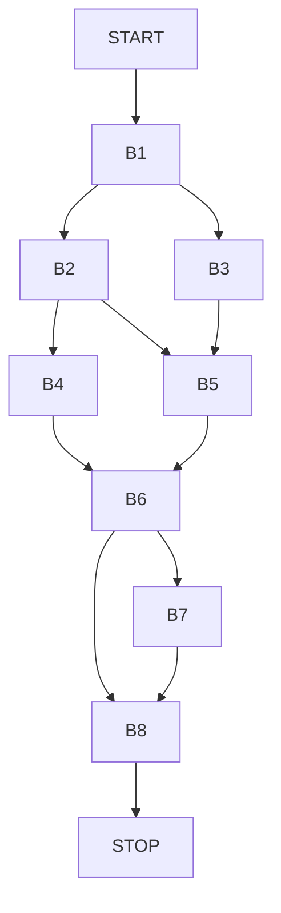

# Problem 3: Reaching Definitions with Complex Control Flow (Difficulty: d2)

## Problem Statement

Analyze the following TAC with nested conditionals and multiple variable redefinitions:

```
B1:  a = 10
     b = 20
     c = a + b
     if c > 25 goto B2 else goto B3

B2:  a = a * 2
     if a > 30 goto B4 else goto B5

B3:  b = b / 2
     c = a - b
     goto B5

B4:  c = a + 100
     a = c - b
     goto B6

B5:  a = b + c
     b = a * 3
     goto B6

B6:  d = a + b + c
     if d > 100 goto B7 else goto B8

B7:  a = 0
     b = 0
     goto B8

B8:  result = a + b + c + d
     return result
```

## Tasks

1. **Define the reaching definitions framework** with all required components.
    - Domain: The set of all definitions in the TAC.
    - Direction: Forwards
    - Generalized Transfer Equation: `OUT[B] = f_B(IN[B])`
    - Meet Operator: Set Union
    - Boundary: `OUT[START] = { }`
    - Initialization: `OUT[B] = { }`
    - Equations:
        - `OUT[B] = gen[B] U (IN[B] - kill[B])`
        - `IN[B] = U_{P \in pred[B]} OUT[P]`

2. **Identify kill and gen sets** for each basic block explicitly.

Note that for the remainder of the assignment we will use a bit-vector for the
definitions of all variables. The notation of the bit vector is as follows:

```
| a1 | a2 | a3 | a4 | a5 | b1 | b2 | b3 | b4 | c1 | c2 | c3 | d1 | result |
```

where a pipe character (`|`) indicates the boundary between bits. We denote the
bit vector as `00000000000000` for the initial state. Each numeral is a bit

| Basic Block | Kill Set       | Gen Set        |
| ----------- | -------------- | -------------- |
| START       | 00000000000000 | 00000000000000 |
| B1          | 00000000000000 | 10000100010000 |
| B2          | 11111000000000 | 01000000000000 |
| B3          | 00000111111100 | 00000010001000 |
| B4          | 11111000011100 | 00100000000100 |
| B5          | 11111111100000 | 00010001000000 |
| B6          | 00000000000010 | 00000000000010 |
| B7          | 11111111100000 | 00001000100000 |
| B8          | 00000000000001 | 00000000000001 |
| STOP        | 00000000000000 | 00000000000000 |

3. **Apply the iterative algorithm** showing at least the first 3 iterations and the final converged state.

First we define the CFG for the program:


Now we can perform the iterative algorithm for reaching definitions over the
TAC given in the problem statement.

| Iteration | Basic Block | IN             | OUT            |
| --------- | ----------- | -------------- | -------------- |
| 0         | START       | 00000000000000 | 00000000000000 |
| 0         | B1          | 00000000000000 | 00000000000000 |
| 0         | B2          | 00000000000000 | 00000000000000 |
| 0         | B3          | 00000000000000 | 00000000000000 |
| 0         | B4          | 00000000000000 | 00000000000000 |
| 0         | B5          | 00000000000000 | 00000000000000 |
| 0         | B6          | 00000000000000 | 00000000000000 |
| 0         | B7          | 00000000000000 | 00000000000000 |
| 0         | B8          | 00000000000000 | 00000000000000 |
| 0         | STOP        | 00000000000000 | 00000000000000 |
| 1         | START       | 00000000000000 | 00000000000000 |
| 1         | B1          | 00000000000000 | 10000100010000 |
| 1         | B2          | 10000100010000 | 01000100010000 |
| 1         | B3          | 10000100010000 | 11000010001000 |
| 1         | B4          | 01000100010000 | 00100100000100 |
| 1         | B5          | 11000110011000 | 00010001011000 |
| 1         | B6          | 00110101011000 | 00110101011010 |
| 1         | B7          | 00110101011010 | 00001000111010 |
| 1         | B8          | 00111101111010 | 00111101111011 |
| 1         | STOP        | 00111101111011 | 00111101111011 |
| 2         | START       | 00000000000000 | 00000000000000 |
| 2         | B1          | 00000000000000 | 10000100010000 |
| 2         | B2          | 10000100010000 | 01000100010000 |
| 2         | B3          | 10000100010000 | 11000010001000 |
| 2         | B4          | 01000100010000 | 00100100000100 |
| 2         | B5          | 11000110011000 | 00010001011000 |
| 2         | B6          | 00110101011000 | 00110101011010 |
| 2         | B7          | 00110101011010 | 00001000111010 |
| 2         | B8          | 00111101111010 | 00111101111011 |
| 2         | STOP        | 00111101111011 | 00111101111011 |


4. **Answer specific questions**:
   - Which definitions of variable `a` reach the assignment `result = a + b + c + d`?
     - `a3, a4, a5` are the only definitions that reach the result assignment
   - Are there any unreachable definitions? Why?
     - In standard reaching definition analysis we do not perform constant
       propagation, so there are no unreachable definitions. Below are the
       unreachable definitions if we performed constant propagation before
       reaching definition analysis:
       - `b2, c2` are unreachable if we perform constant propagation since
         `a + b = 30`
       - `c3, a3` are also unreachable if we perform constant propagaion since
         given the control flow graph (no backwards edges to B2), we know that
         `a = 20` at the end of B2.
   - Which basic block has the most complex IN set and why?
     - B6 has the most complex in set due to the convergence of two distinct
       control flow paths and the relationships between the gen and kill sets
       shown on those paths.

## Expected Output Format

- Kill and Gen sets for each basic block
- Iteration-by-iteration IN/OUT sets
- Answers to the specific questions with justification
